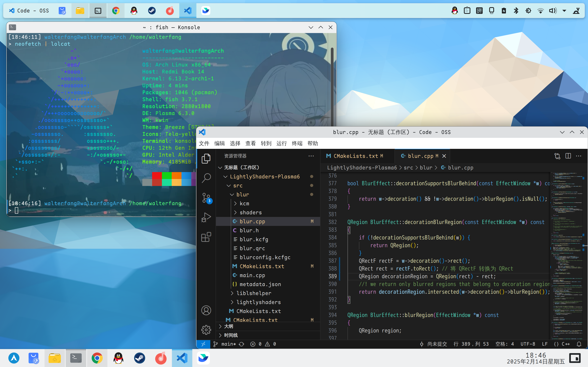

English | [中文](README_zh.md)

## Ensure that versions prior to Plasma 6.2.9 are available, Plasma 6.3 is currently unavailable.

# LightlyShaders v3.0

 This effect works correctly with stock Plasma effects.Supports KDE Plasma 6.

 


# Dependencies:
 
Plasma Version >= 6.0.
 
You will need qt6, kf6 and kwin development packages.

**Arch**:

`sudo pacman -S git make cmake gcc gettext extra-cmake-modules qt5-tools qt5-x11extras kcrash kglobalaccel kde-dev-utils kio knotifications kinit kwin`

# Manual installation
```
git clone https://github.com/walterfang12/LightlyShaders-Plasma6

cd LightlyShaders;

mkdir qt6build; cd qt6build; cmake ../ -DCMAKE_INSTALL_PREFIX=/usr && make && sudo make install
```

## Note
After some updates of Plasma this plugin may need to be recompiled in order to work with changes introduced to KWin.
 
