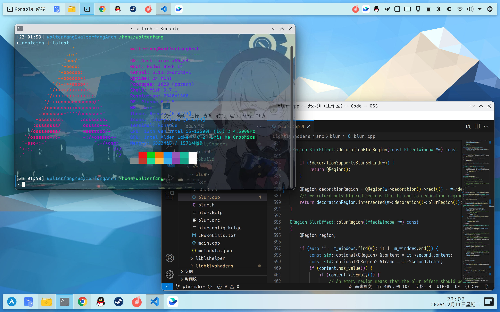

[English](README.md) | 中文

# LightlyShaders v3.0

 此效果与已有的 Plasma 特效一起正常工作。支持 KDE Plasma 6。

 

# 依赖关系：

 Plasema版本>=6.0。 

 您将需要qt6、kf6和kwin开发包。 

 **Arch** 下的依赖安装： 
 
 `sudo pacman -S git make cmake gcc gettext extra-cmake-modules qt5-tools qt5-x11extras kcrash kglobalaccel kde-dev-utils kio knotifications kinit kwin`
 
# 手动安装 

```bash
git clone https://github.com/walterfang12/LightlyShaders-Plasma6 && cd LightlyShaders
mkdir qt6build && cd qt6build
cmake ../ -DCMAKE_INSTALL_PREFIX=/usr && make && sudo make install
```

**注： 在Plasma进行了一些更新后，可能需要重新编译此插件，以便处理引入KWin的更改。**